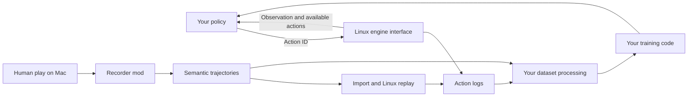

# STS2 Tools

English | [简体中文](README.zh-CN.md)

Original-engine tooling for ML/RL workflows in Slay the Spire 2, with structured observations, actions, replay, and human gameplay recording.

STS2 Tools connects the original game engine to external policies and research code. Use Linux to run decision loops, collect trajectories, and replay recorded inputs. Use the Mac mod to collect human demonstrations through normal mouse play. The engine resolves game rules; your code chooses actions and defines the learning objective.

## Components and data flow

| Component | Use it for |
| --- | --- |
| [Linux tools](linux/README.md) | Read structured observations, submit actions, and collect the next decision state. Connect your policy through the JSONL worker or file bridge. |
| [Mac recorder](mac/README.md) | Capture human inputs, targets, nested selections, action outcomes, and decision observations. |
| [Replay tools](docs/REPLAY.md) | Map Mac semantic trajectories to Linux actions and compare the resulting decision states. |
| [Learning example](linux/README.md#training-and-datasets) | Try a small combat imitation-learning loop with checkpoint updates and resume, then connect your own data processing and training. |

## Compatibility

| Item | v0.1.2-alpha |
| --- | --- |
| Game | STS2 **v0.111.0**, commit **41cef1ea**, Steam build **24724944** |
| Linux | x86_64; reference host Ubuntu 24.04.5 |
| Mac | Apple Silicon / arm64 |
| Gameplay | Single-player Silent, Ascension 0, using your profile's progression |

Platform-specific versions and file hashes are in [linux/config](linux/config/) and [mac/config](mac/config/).

## What you need

### Provided by this repository

| Item | Purpose and access |
| --- | --- |
| Source code | [Download source ZIP](https://github.com/Jtshieh/STS2-Tools/archive/refs/heads/main.zip) or clone this repository to build, extend, or inspect the tools. |
| Precompiled Mac mod | [Download recorder ZIP](https://github.com/Jtshieh/STS2-Tools/releases/download/v0.1.2-alpha/Sts2Recorder-macos-arm64-v0.1.0-alpha.zip) to record gameplay. Includes the recorder DLL, mod manifest, and license files. |
| Linux tools | [linux/](linux/) contains preparation, build, play, trajectory export, and replay entry points. Build locally against your game. |
| Configuration and examples | [Linux configuration](linux/config/), [Mac configuration](mac/config/), the [policy example](linux/scripts/sts2_policy.py), and [learning example](linux/scripts/sts2_train.py) provide version manifests and integration starting points. |

### Prepare yourself

| Route | Materials and dependencies |
| --- | --- |
| Mac precompiled mod | Compatible Mac game and your game profile. The game supplies the mod runtime. |
| Mac source build or separate workspace | Compatible Mac game; Python 3.12 and arm64 .NET 9 SDK for building. The separate-workspace route also uses your saved profile and macOS `sandbox-exec`. See [Mac setup](mac/README.md#what-you-need). |
| Linux control or replay | Compatible Linux game, your profile files, Python 3.12, bubblewrap, and the pinned native/.NET/Godot build inputs. See the [dependency list](linux/README.md#prepare-yourself). |
| Mac-to-Linux replay | A recorded trajectory and matching initial profile, seed, and run save for Continue. See [replay starting materials](docs/REPLAY.md#prepare-the-starting-state). |

## Try the trajectory format

Run the [synthetic decision example](examples/README.md) with Python to inspect an observation, action, and successor before setting up the game. The same reader accepts exported Linux action logs.

## Start with Linux control

Follow [Linux setup](linux/README.md#prepare-a-workspace), then run a bounded manual or policy-driven session. The [policy integration guide](linux/README.md#connect-your-policy) shows how `sts2_play.py --mode auto` sends observations to `choose(obs)` in the supplied worker and submits its selected action to the engine.

Use the [observation and action protocol](linux/PROTOCOL.md) to connect a custom controller or turn completed decisions into training examples.

## Start with human demonstrations

Download the [Mac mod ZIP](https://github.com/Jtshieh/STS2-Tools/releases/download/v0.1.2-alpha/Sts2Recorder-macos-arm64-v0.1.0-alpha.zip), place `Sts2Recorder.dll` and `Sts2Recorder.json` in `SlayTheSpire2.app/Contents/MacOS/mods/`, and launch the game. The main menu displays `RECORDER READY` and the session's log directory.

Follow [Mac recording and export](mac/README.md), then [replay the trajectory on Linux](docs/REPLAY.md) or process its decision observations and human choices in your own dataset pipeline.

## Contribute

See [contribution guidance](CONTRIBUTING.md) for reporting problems, proposing changes, and choosing relevant checks.

## License

[MIT](LICENSE). Third-party attribution: [NOTICE.md](NOTICE.md), [Linux notices](linux/NOTICE.md), and [Mac attribution](mac/src/ATTRIBUTION.md).
