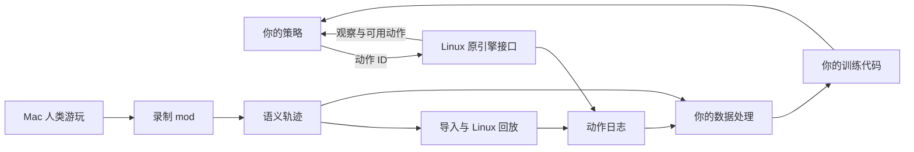

# STS2 Tools

[English](README.md) | 简体中文

基于 Slay the Spire 2 原游戏引擎的 ML/RL 工具集，提供结构化观察、动作执行、回放和人类游玩录制。

STS2 Tools 将原游戏引擎接入外部策略与研究代码。在 Linux 上运行决策循环、采集轨迹并回放输入；通过 Mac mod 录制正常鼠标游玩中的人类示范。游戏引擎负责规则结算，你的代码负责选择动作和定义学习目标。

## 核心组件与数据流

| 组件 | 用途 |
| --- | --- |
| [Linux 工具](linux/README.zh-CN.md) | 读取结构化观察、提交动作并取得下一决策状态，通过 JSONL 策略进程或文件桥接入自己的策略。 |
| [Mac 录制器](mac/README.zh-CN.md) | 采集人类输入、目标、嵌套选择、动作结果和决策点观察。 |
| [回放工具](docs/REPLAY.zh-CN.md) | 将 Mac 语义轨迹映射为 Linux 动作，比较执行后的决策状态。 |
| [学习示例](linux/README.zh-CN.md#训练与数据集) | 运行小型战斗模仿学习循环，更新和恢复 checkpoint，再接入自己的数据处理与训练代码。 |

## 兼容性

| 项目 | v0.1.0-alpha |
| --- | --- |
| 游戏 | STS2 **v0.111.0**，commit **41cef1ea**，Steam build **24724944** |
| Linux | x86_64；参考宿主 Ubuntu 24.04.5 |
| Mac | Apple Silicon / arm64 |
| 玩法 | 单人 Silent（猎手），进阶 0，使用自己 profile 的解锁进度 |

各平台版本与文件哈希见 [linux/config](linux/config/) 和 [mac/config](mac/config/)。

## 需要什么

### 本仓库提供

| 内容 | 用途与获取入口 |
| --- | --- |
| 源码 | [下载源码 ZIP](https://github.com/Jtshieh/STS2-Tools/archive/refs/heads/main.zip) 或克隆本仓库，用于构建、扩展和阅读实现。 |
| Mac mod 预编译包 | [下载 v0.1.0-alpha ZIP](https://github.com/Jtshieh/STS2-Tools/releases/download/v0.1.0-alpha/Sts2Recorder-macos-arm64-v0.1.0-alpha.zip)，用于录制游玩，包含录制器 DLL、mod 描述和许可文件。 |
| Linux 工具 | [linux/](linux/) 提供准备、构建、运行、轨迹导出和回放入口，使用本机游戏材料构建。 |
| 配置与示例 | [Linux 配置](linux/config/)、[Mac 配置](mac/config/)、[策略示例](linux/scripts/sts2_policy.py) 和[学习示例](linux/scripts/sts2_train.py) 提供版本清单与接入起点。 |

### 用户自行准备

| 使用路径 | 材料与依赖 |
| --- | --- |
| Mac 预编译 mod | 兼容的 Mac 游戏及自己的游戏 profile。mod 运行时由游戏提供。 |
| Mac 源码构建或独立工作区 | 兼容的 Mac 游戏；构建需要 Python 3.12 和 arm64 .NET 9 SDK。独立工作区还使用自己的存档 profile 和 macOS `sandbox-exec`，见 [Mac 准备说明](mac/README.zh-CN.md#需要什么)。 |
| Linux 控制或回放 | 兼容的 Linux 游戏、自己的 profile 文件、Python 3.12、bubblewrap，以及固定的原生/.NET/Godot 构建输入，见[依赖清单](linux/README.zh-CN.md#用户自行准备)。 |
| Mac 到 Linux 回放 | 录制轨迹，以及匹配的初始 profile、种子；Continue 还需起点 run save，见[回放起点材料](docs/REPLAY.zh-CN.md#准备起点状态)。 |

## 从 Linux 程序控制开始

按照 [Linux 准备流程](linux/README.zh-CN.md#准备工作区) 完成配置，再运行有动作上限的人工或策略会话。[策略接入说明](linux/README.zh-CN.md#接入自己的策略) 介绍 `sts2_play.py --mode auto` 如何将观察交给示例策略进程的 `choose(obs)`，并把选中的动作提交给引擎。

通过[观察与动作协议](linux/PROTOCOL.zh-CN.md) 接入自己的控制器，或将已完成的决策整理为训练样本。

## 从人类示范采集开始

下载 [Mac mod ZIP](https://github.com/Jtshieh/STS2-Tools/releases/download/v0.1.0-alpha/Sts2Recorder-macos-arm64-v0.1.0-alpha.zip)，将 `Sts2Recorder.dll` 和 `Sts2Recorder.json` 放入 `SlayTheSpire2.app/Contents/MacOS/mods/`，启动游戏。主菜单会显示 `RECORDER READY` 和本次会话的日志目录。

按照 [Mac 录制与导出说明](mac/README.zh-CN.md) 取得轨迹，再[接入 Linux 回放](docs/REPLAY.zh-CN.md)，或将决策观察与人类选择接入自己的数据集处理流程。

## 许可

[MIT](LICENSE)。第三方归属见 [NOTICE.md](NOTICE.md)、[Linux 归属说明](linux/NOTICE.md) 和 [Mac 归属说明](mac/src/ATTRIBUTION.md)。
